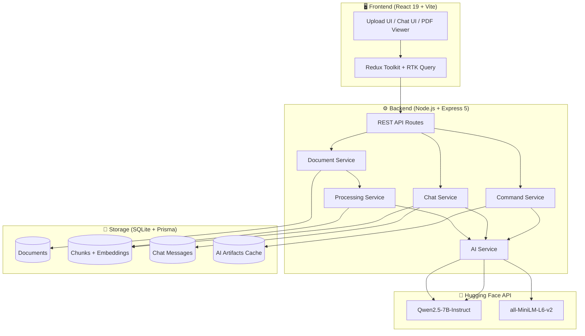
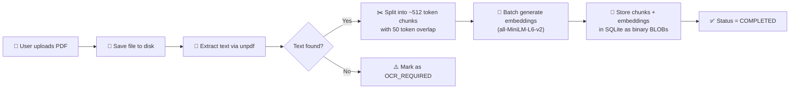
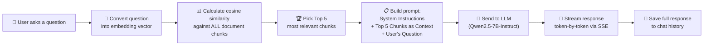
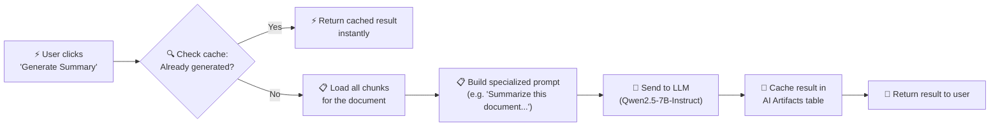

# DocIQ — AI-Powered PDF Intelligence Platform

Welcome to **DocIQ**, a full-stack, AI-driven application designed to transform static PDF documents into interactive, intelligent conversations. 

DocIQ was built with a clear mission: to allow users to instantly extract knowledge, summaries, and deep insights from large documents without needing to read them page by page. By leveraging modern **Retrieval-Augmented Generation (RAG)** and open-source AI models, DocIQ acts as your personal document analyst.

Often, researchers, students, and professionals are bogged down by massive PDF files. DocIQ solves this by allowing you to upload any PDF and immediately start chatting with it. You can ask specific questions like *"What is the main conclusion of chapter 3?"* or use the One-Click AI Actions to instantly generate a summary or extract key points.

---

## 🏗️ System Architecture Chart

Below is the high-level architecture showcasing how the frontend, backend, database, and AI services communicate.



---

## ✨ Core Features

- 📄 **Smart PDF Parsing:** Upload any standard PDF, and the backend instantly extracts and parses the raw text.
- 🧠 **Vector Embeddings (RAG):** The document is split into intelligent "chunks" and converted into mathematical vectors (embeddings) using Hugging Face's `sentence-transformers`. This allows the AI to perfectly understand the semantic meaning of your document.
- 💬 **Real-Time Streaming Chat:** Chat with your document! When you ask a question, the AI streams its answer back to you in real-time (like ChatGPT), complete with markdown formatting.
- ⚡ **One-Click AI Actions:** Instantly trigger complex AI workflows directly from the sidebar:
  - **Generate Summary:** Provides a highly detailed executive summary.
  - **Extract Key Points:** Pulls out the most important facts.
  - **Generate Insights:** Synthesizes the information into actionable takeaways.
- 🎨 **Premium Glassmorphic UI:** Built with Tailwind CSS v4 and Shadcn UI, featuring rich gradients, interactive hover states, and smooth animations that work perfectly in both Light and Dark mode.
- 📖 **Integrated PDF Viewer:** Read the document side-by-side with the AI chat. The viewer includes full zoom controls and a custom maximize feature for comfortable reading.

---

## 🔄 End-to-End Flows

### 1. PDF Upload & Processing Pipeline


**How it works:** The file is saved and text is extracted using `unpdf`. The text is algorithmically split into overlapping chunks, sent to Hugging Face to be converted into 384-dimensional vector embeddings, and stored locally in SQLite.

### 2. Chat with Your PDF (The RAG Pipeline)


**How it works:** Your question is converted into a vector and compared against all document chunks using Cosine Similarity. The top 5 most relevant paragraphs are injected into the AI's prompt, and the response is streamed back in real-time via Server-Sent Events (SSE).

### 3. One-Click AI Commands (Summary / Key Points / Insights)


**How it works:** The backend first checks if the artifact has already been generated. If not, it loads the document, builds a specialized command prompt, and requests a full-context answer from the LLM. The result is then cached permanently.

---

## 🚀 Requirements and Setup

It takes less than 5 minutes to set up DocIQ locally on your machine.

### Prerequisites
- Node.js (v20 or higher)
- npm (Node Package Manager)
- A free [Hugging Face](https://huggingface.co/) Account and Access Token.

### 1. Clone the repository
```bash
git clone https://github.com/harsh18082001/ai-pdf-intelligence.git
cd ai-pdf-intelligence
```

### 2. Setup the Backend
Navigate to the server directory and install dependencies:
```bash
cd server
npm install
```

Create a `.env` file in the `server` directory and add your Hugging Face API token:
```env
HF_API_TOKEN="your_hugging_face_token_here"
```

Initialize the Prisma SQLite database and start the server:
```bash
npx prisma db push
npm run dev
```
*(The backend will start running on http://localhost:3000)*

### 3. Setup the Frontend
Open a new terminal, navigate to the client directory, and install dependencies:
```bash
cd client
npm install
```

Start the Vite development server:
```bash
npm run dev
```
*(The frontend will start running on http://localhost:5173)*

### 4. You're Done!
Open your browser to `http://localhost:5173` and start chatting with your PDFs!

---

## 🤖 Acknowledgments
This project was pair-programmed and built from the ground up with the assistance of **Antigravity**, an advanced agentic AI coding assistant developed by Google DeepMind. Together, we navigated architectural decisions, built the RAG pipeline, and polished the glassmorphic UI!
