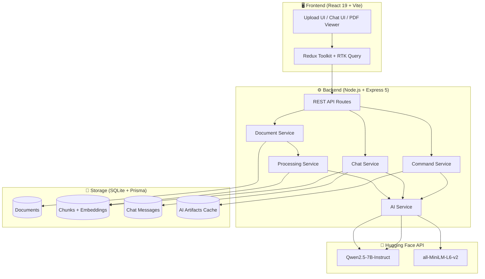
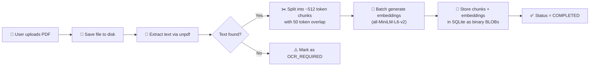
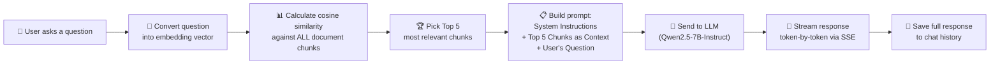
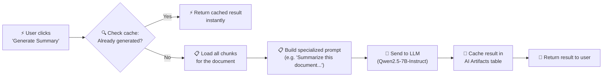

# DocIQ — AI-Powered PDF Intelligence Platform

Welcome to **DocIQ**, a full-stack, AI-driven application designed to transform static PDF documents into interactive, intelligent conversations. 

DocIQ was built with a clear mission: to allow users to instantly extract knowledge, summaries, and deep insights from large documents without needing to read them page by page. By leveraging modern **Retrieval-Augmented Generation (RAG)** and open-source AI models, DocIQ acts as your personal document analyst.

---

## 🌟 The Vision & Overview
Often, researchers, students, and professionals are bogged down by massive PDF files. DocIQ solves this by allowing you to upload any PDF and immediately start chatting with it. 

You can ask specific questions like *"What is the main conclusion of chapter 3?"* or use the **One-Click AI Actions** to instantly generate a summary or extract key points. The application is designed with a premium, glassmorphic UI to make interacting with dense information an absolute pleasure.

## ✨ Core Features
- 📄 **Smart PDF Parsing:** Upload any standard PDF, and the backend instantly extracts and parses the raw text.
- 🧠 **Vector Embeddings (RAG):** The document is split into intelligent "chunks" and converted into mathematical vectors (embeddings) using Hugging Face's `sentence-transformers`. This allows the AI to perfectly understand the semantic meaning of your document.
- 💬 **Real-Time Streaming Chat:** Chat with your document! When you ask a question, the AI streams its answer back to you in real-time (like ChatGPT), complete with markdown formatting.
- ⚡ **One-Click AI Actions:** Instantly trigger complex AI workflows directly from the sidebar:
  - **Generate Summary**
  - **Extract Key Points**
  - **Generate Insights**
- 🎨 **Premium Glassmorphic UI:** Built with Tailwind CSS v4 and Shadcn UI, featuring rich gradients, interactive hover states, and smooth animations that work perfectly in both Light and Dark mode.
- 📖 **Integrated PDF Viewer:** Read the document side-by-side with the AI chat. The viewer includes full zoom controls and a custom maximize feature for comfortable reading.

---

## 🏗️ System Architecture



### Tech Stack

| Layer | Technology | Purpose |
|-------|-----------|---------|
| **Frontend** | React 19, Vite, TypeScript | UI Framework & Build Tool |
| **State** | Redux Toolkit, RTK Query | API Caching & State Management |
| **Styling** | Tailwind CSS v4, Shadcn UI | Design System & Components |
| **PDF Viewer** | react-pdf | In-browser PDF rendering |
| **Backend** | Node.js, Express 5 | Async-first API Server |
| **Database** | Prisma ORM, SQLite | Zero-config persistent storage |
| **AI Chat** | Qwen/Qwen2.5-7B-Instruct | LLM for Q&A and commands |
| **AI Embeddings** | all-MiniLM-L6-v2 | 384-dim vector embeddings |
| **PDF Parsing** | unpdf | Serverless PDF text extraction |
| **DevOps** | Docker, Docker Compose | Containerized deployment |

---

## 🔄 How It Works — End-to-End Flows

### Flow 1: PDF Upload & Processing Pipeline



**What happens when you upload a PDF:**
1. The file is saved to disk and a database record is created with status `PROCESSING`.
2. `unpdf` extracts all the raw text from the PDF pages.
3. The text is split into overlapping chunks of ~512 tokens each (so no information is lost between chunk boundaries).
4. All chunks are sent to Hugging Face in a batch to generate 384-dimensional vector embeddings.
5. The chunks and their embeddings are stored in SQLite. The document status becomes `COMPLETED`.

---

### Flow 2: Chat with Your PDF (The RAG Pipeline)



**What happens when you ask a question:**
1. Your question is converted into an embedding vector (same model used during upload).
2. The backend loads all chunks for that document and calculates the **Cosine Similarity** between your question vector and each chunk vector.
3. The top 5 most relevant chunks are selected.
4. A prompt is built: *"Here is context from the document: [top 5 chunks]. Answer this question: [your question]"*
5. The prompt is sent to the LLM, which streams its answer back token-by-token via **Server-Sent Events (SSE)**.
6. The complete answer is saved to the database as chat history.

---

### Flow 3: One-Click AI Commands (Summary / Key Points / Insights)



**What happens when you click an AI command:**
1. The backend first checks if this command was already run for this document (cache lookup).
2. If cached, it returns the result instantly without calling the AI again.
3. If not cached, it loads all the document chunks, builds a specialized prompt (different for Summary vs Key Points vs Insights), and sends it to the LLM.
4. The result is cached in the database so future clicks are instant.

---

### How the AI Actually Works (The RAG Pipeline)
1. **Extraction:** When a PDF is uploaded, `unpdf` extracts all the raw text.
2. **Chunking:** The text is algorithmically split into overlapping ~512-token chunks.
3. **Embedding:** Each chunk is sent to Hugging Face to be converted into a 384-dimensional vector, which is saved as binary data in the SQLite database.
4. **Retrieval:** When you ask a question, the backend calculates the mathematical *Cosine Similarity* between your question and every chunk in the database, picking the top 5 most relevant paragraphs.
5. **Generation:** Those paragraphs are secretly injected into the AI's prompt, allowing it to answer your question with perfect accuracy based *only* on the document!

---

## 🚀 Running the Project Locally
If you wish to test this project locally on your machine, it takes less than 5 minutes to set up.

### Prerequisites
- Node.js (v20+)
- A free [Hugging Face](https://huggingface.co/) Account and Access Token.

### Setup Steps
1. **Clone the repository**
2. **Setup the Backend:**
   ```bash
   cd server
   npm install
   ```
   Create a `.env` file in the `server` directory:
   ```env
   HF_API_TOKEN="your_hugging_face_token"
   ```
   Initialize the database and start the server:
   ```bash
   npx prisma db push
   npm run dev
   ```
3. **Setup the Frontend:**
   Open a new terminal and run:
   ```bash
   cd client
   npm install
   npm run dev
   ```
4. Open your browser to `http://localhost:5173` and enjoy!

---

## 🤖 Acknowledgments
This project was pair-programmed and built from the ground up with the assistance of **Antigravity**, an advanced agentic AI coding assistant developed by Google DeepMind. Together, we navigated architectural decisions, built the RAG pipeline, and polished the glassmorphic UI!

---
*Built with ❤️ for the future of document intelligence.*
